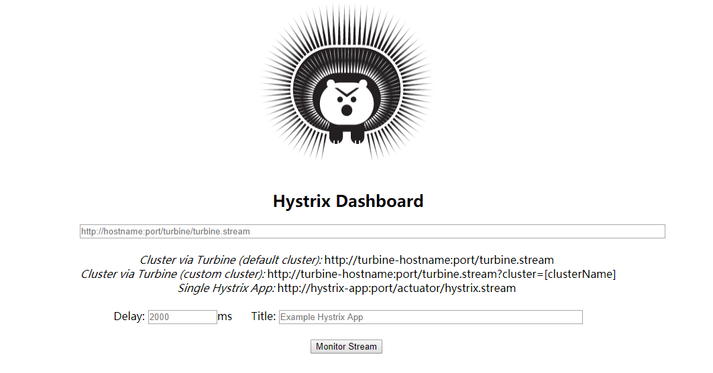
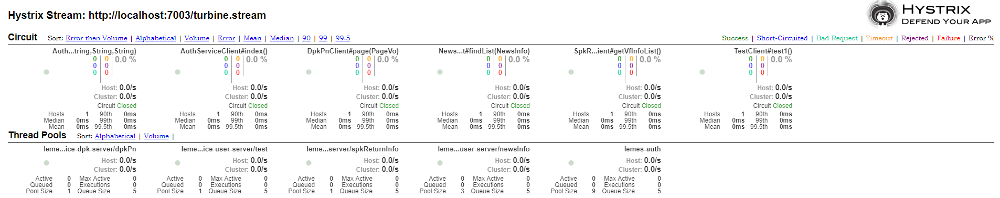
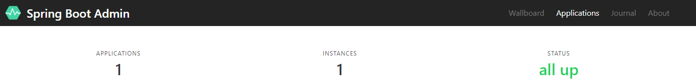

# lemes-monitor
这是一个Hystrix 监控模块


## Dashboard

hystrix 里面提供一个Dashboard（仪表盘）的功能，它是一种监控的功能，可以利用它来进行整体服务的监控。

### 快速开始

在pom.xml 中引用jar包

```xml
<dependency>
    <groupId>org.springframework.cloud</groupId>
    <artifactId>spring-cloud-starter-netflix-hystrix</artifactId>
</dependency>
<dependency>
    <groupId>org.springframework.cloud</groupId>
    <artifactId>spring-cloud-starter-netflix-hystrix-dashboard</artifactId>
</dependency>
```

spring boot 的启动类上添加注解  `@EnableHystrixDashboard`  

启动项目打开浏览器输入：http://server:port/hystrix  展示如下界面



按照界面说明输入需要监控的相应模块，点击 **Monitor Stream** 即可看到相关的监控视图

> 注意：需要监控的模块启动类上要加入注解  `@EnableHystrix`  或者  `@EnableCircuitBreaker`


## Turbine

HystrixDashboard 它的主要功能是可以对某一项微服务进行监控，但真实情况下，不可能只对某一个服务进行监控，更多的是对很多服务进行一个整体的监控，这个时候就需要使用到turbine来完成了。

### 快速开始

在pom.xml 中引用jar包

```xml
<dependency>
    <groupId>org.springframework.cloud</groupId>
    <artifactId>spring-cloud-starter-netflix-turbine</artifactId>
</dependency>
```

spring boot 的启动类上添加注解 `@EnableTurbine`

配置文件修改：

```yaml
eureka:
  client:
    service-url:
      defaultZone: http://localhost:10001/eureka/
    register-with-eureka: false
turbine:
  aggregator:
    cluster-config: default
  #配置Eureka中的serviceId列表，表明监控哪些服务
  app-config: feign-sample
  #设置监控的表达式，通过此表达式表示要获取监控信息名称
  cluster-name-expression: "'default'"
```


特别注意一点，如果需要监控的项目是在外部容器中运行，如 jboos 容器中，需要在项目的配置文件中新增配置

```yaml
eureka:
  instance:
    metadata-map:
      management.port: ${management.port:${server.port}/${spring.application.name}}
```


然后在 Dashboard 的界面中，输入 http://server:port/turbine.stream    点击 **Monitor Stream** 即可看到所有模块的相关监控视图




## Spring Boot Admin

Spring Boot Admin是一个开源社区项目，用于管理和监控SpringBoot应用程序。

### 快速开始

**admin Server 端**

在pom.xml 中引用jar包

```xml
<dependency>
    <groupId>de.codecentric</groupId>
    <artifactId>spring-boot-admin-starter-server</artifactId>
    <version>2.1.4</version>
</dependency>
<dependency>
    <groupId>org.springframework.boot</groupId>
    <artifactId>spring-boot-starter-web</artifactId>
</dependency>
```

spring boot 的启动类上添加注解 `@EnableAdminServer`

**admin Client 端**

```xml
<dependency>
    <groupId>de.codecentric</groupId>
    <artifactId>spring-boot-admin-starter-client</artifactId>
    <version>2.1.4</version>
</dependency>
```

配置文件新增

```yaml
spring:
  boot:
    admin:
      client:
        url: http://server:port
```

记得要暴露自己的actuator的所有端口信息

启动项目打开浏览器输入：http://server:port  展示如下界面




### 结合注册中心使用

**admin server 端**

pom.xml 添加如下 eureka 客户端

```xml
<dependency>
    <groupId>org.springframework.cloud</groupId>
    <artifactId>spring-cloud-starter-netflix-eureka-client</artifactId>
</dependency>
```

配置文件新增

```yaml
eureka:
  client:
    service-url:
      defaultZone: http://localhost:10001/eureka/
    register-with-eureka: false
```

admin client 端 不需要再配置 spring.boot.admin.client.url 了

启动相关的项目，就可以在界面中看到对应的信息了，这里就不再描述了

